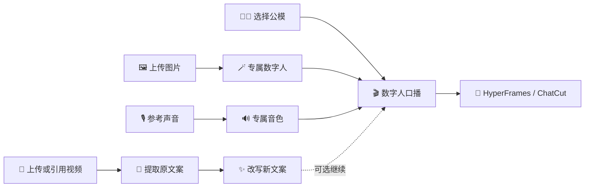

<div align="center">
  <a href="https://lab.lycheeai.com.cn/">
    
  </a>

  # Avatar Forge

  ### 让每一个创意，都拥有自己的数字人表达

  选择公模快速开拍，或用一张照片和一段声音创建专属数字人。<br />
  从参考视频提炼新文案，再与 HyperFrames 或 ChatCut 组合成完整口播作品。

  [](https://github.com/LycheeAILab/avatar-forge/releases/tag/v2.1.0)
  [](#-安装)
  [](#workbuddy)
  [](LICENSE)

  [核心能力](#-核心能力) · [使用方式](#-一句话完成创作) · [安装](#-安装) · [安全边界](#-安全与授权)
</div>

---

## ✨ 核心能力

| | 能力 | 你提供 | Avatar Forge 交付 |
| :---: | --- | --- | --- |
| 🧑‍💼 | **丰富公模** | 文案或成品音频 | 快速生成数字人口播视频 |
| 🪄 | **专属数字人** | 一张清晰人物图片 | 创建可用于口播的个人数字人 |
| 🎙️ | **声音克隆** | 一段已授权参考声音 | 专属音色与自然口播音频 |
| 🎬 | **视频文案再创作** | 上传视频或有权使用的抖音链接 | 原始转写稿与独立改写稿 |
| 🧩 | **创作工具组合** | 数字人视频与创作目标 | 接入 HyperFrames 或 ChatCut，继续完成包装与剪辑 |

> [!TIP]
> 每项能力都能独立使用。你可以只下载视频、只提取文案、只改写、只克隆声音，或一次完成数字人视频。

## 🧭 一句话完成创作

不需要记命令，也不必理解复杂流程。把素材交给 Agent，然后描述结果即可。

```text
使用 Avatar Forge，从公模中选择一位适合科技内容的数字人，制作这段口播稿。
```

```text
使用 Avatar Forge，用这张人物图片和已授权参考声音，生成我的专属数字人口播视频。
```

```text
使用 Avatar Forge，下载这个我有权使用的抖音视频，提取原文案，
并改写成一版 60 秒、自然口语风格的新稿。完成文案后停止。
```

```text
使用 Avatar Forge 生成数字人视频，再交给 HyperFrames 或 ChatCut 完成字幕、包装和剪辑。
```

## 🧱 自由组合，不被流水线限制



- 已经有视频：可以直接匹配口型。
- 已经有声音：可以跳过声音克隆。
- 已经有数字人：可以直接生成新的口播内容。
- 只需要文案：转写和改写完成后立即停止，不触发视频生成。
- 长任务意外中断：重新运行相同任务即可从已保存进度继续。

## 📦 安装

### Codex

#### 让 Codex 自动安装

在 Codex 桌面端新建任务并发送：

> 阅读 https://raw.githubusercontent.com/LycheeAILab/avatar-forge/v2.1.0/INSTALL.md，帮我安装 Avatar Forge。

#### 手动安装

```powershell
codex plugin marketplace add https://github.com/LycheeAILab/avatar-forge.git --ref v2.1.0
codex plugin add avatar-forge@avatar-forge
```

安装完成后新建一个 Codex 任务，使插件在新会话中加载。

### WorkBuddy

在 WorkBuddy 中发送：

> 阅读 https://raw.githubusercontent.com/LycheeAILab/avatar-forge/v2.1.0/WORKBUDDY_INSTALL.md，帮我安装 Avatar Forge 2.1.0；安装后只运行本地 doctor，不要提交任何生成任务。

也可以从 [Avatar Forge 2.1.0 Release](https://github.com/LycheeAILab/avatar-forge/releases/tag/v2.1.0) 下载 `avatar-forge-workbuddy-2.1.0.zip`，然后在 WorkBuddy 的 Skills 页面上传。

## ✅ 素材建议

### 人物图片

> [!IMPORTANT]
> 请确认人物脸部清晰、没有遮挡、完整露出，且人物在画面中的比例适中。模糊、遮脸、面部超出画面或人物过大/过小都会影响生成效果。

### 参考声音

- 只使用本人声音，或已经获得明确授权的声音。
- 尽量选择人声清楚、环境噪声较少的录音。
- 避免背景音乐、多人同时讲话和明显混响。

### 参考视频

- 可以直接上传本地视频，也可以提供有权下载和使用的抖音链接。
- 原始转写稿与改写稿分别保存，不会互相覆盖。
- 只有在你明确要求后，改写稿才会继续进入声音或数字人生成。

## 🛡️ 安全与授权

- **先授权再生成**：仅处理你拥有合法使用权的人物、声音、视频和文案。
- **费用有确认**：未经用户确认，不提交可能产生费用的生成任务。
- **密钥不下发**：第三方服务凭据留在服务端，不进入仓库、用户文件或日志。
- **Cookie 不外传**：需要本机浏览器登录态时必须先征得许可，不要求粘贴、打印或保存 Cookie。
- **拒绝冒充滥用**：不得用于冒充他人、欺骗公众或制作违法违规内容。

## 🔌 生态组合

Avatar Forge 专注于数字人的创建、声音与口播生成。成片可以继续交给：

- **HyperFrames**：制作动态图形、字幕、品牌视觉和节目包装。
- **ChatCut**：完成口播剪辑、字幕、配乐、素材编排和最终导出。

这样既可以快速生成一条干净的数字人口播，也可以把它扩展成完整的短视频作品。

## 📄 开源协议

Avatar Forge 自有代码基于 [MIT License](LICENSE) 开源。视频下载与本地转写使用独立的开源依赖，并遵循各自许可证。第三方平台服务受其服务条款约束。

---

<div align="center">
  <strong>Avatar Forge</strong><br />
  <sub>Built with care by <a href="https://lab.lycheeai.com.cn/">LycheeAILab</a></sub>
</div>
