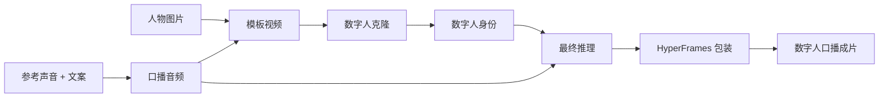

<div align="center">
  <a href="https://lab.lycheeai.com.cn/">
    
  </a>

  # Avatar Forge

  **让一张照片，成为可以开口表达的数字人。**

  面向 AI Agent 的开源数字人视频工作流。<br />
  从人物图片、参考声音和口播稿出发，生成完整的数字人口播视频。

  [](LICENSE)
  [](#安装)
  [](https://lab.lycheeai.com.cn/)
</div>

<br />

## 它能做什么

Avatar Forge 将声音生成、数字人模板、人物克隆、视频推理与后期包装拆成独立能力。Agent 可以只执行其中一步，也可以自动完成整条流水线。

| 能力 | 输入 | 输出 |
| --- | --- | --- |
| 声音克隆 | 参考声音 + 文案 | WAV 口播音频 |
| 模板生成 | 人物图片 + 口播音频 | 数字人模板视频 |
| 数字人克隆 | 模板视频 | 可复用的数字人身份 |
| 数字人推理 | 数字人身份 + 音频 | 最终口播视频 |
| 视频包装 | 最终视频 + 文案 | 字幕与版式完整的成片 |

## 工作流



每一个阶段都有独立任务 ID 和持久化结果。任务中断后可以从当前阶段继续，不会重复创建已经提交的付费任务。

## 安装

### 让 Codex 帮你安装

在 Codex 桌面端新建任务，发送下面这句话：

> 阅读 https://raw.githubusercontent.com/LycheeAILab/avatar-forge/main/INSTALL.md，帮我安装 Avatar Forge。

### 手动安装

```powershell
codex plugin marketplace add https://github.com/LycheeAILab/avatar-forge.git --ref main
codex plugin add avatar-forge@avatar-forge
```

安装后请新建一个 Codex 任务，使插件在新会话中加载。

## 开始创作

把拥有合法使用权的素材交给 Codex，然后直接描述目标：

> 使用 Avatar Forge，把这张人物图片、参考声音和口播稿制作成一条完整的数字人口播视频。

首次使用时，Avatar Forge 会打开 LycheeAILab 登录授权页。完成登录后，Codex 会自动执行任务并在各阶段之间安全传递结果。

也可以只使用某一项能力：

```text
使用 Avatar Forge，根据参考声音和这段文案生成口播音频。
使用 Avatar Forge，把这张人物图片制作成可复用的数字人。
使用 Avatar Forge，让这个数字人使用指定音频生成口播视频。
```

## 设计原则

- **可组合**：声音、模板、克隆、推理和包装均可独立调用。
- **可恢复**：长任务保留阶段状态，可根据任务 ID 继续执行。
- **凭据隔离**：供应商密钥只保存在 LycheeAILab 服务端的加密凭据库。
- **结果持久化**：生成的音频和视频转存至私有对象存储，不依赖临时链接。
- **Agent 原生**：无需额外操作页面，由 Agent 理解目标并选择正确流程。

## 安全与授权

Avatar Forge 通过 LycheeAILab 账户完成身份验证。插件本地只保存用户可撤销的 API Key，不会获取或暴露 MiMo、RunningHub、数字人服务和对象存储的供应商凭据。

请仅上传已获得合法授权的人物图片、声音、视频和文案。不得利用本项目冒充他人、误导公众或生成违法违规内容。

## 开源协议

本项目基于 [MIT License](LICENSE) 开源。

<br />

<div align="center">
  <sub>Built with care by <a href="https://lab.lycheeai.com.cn/">LycheeAILab</a></sub>
</div>
