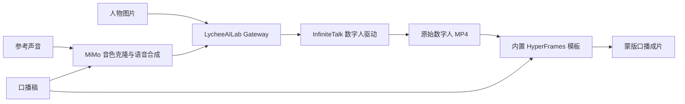

<div align="center">
  

  # Avatar Forge

  **一张图片、一段参考声音、一份口播稿，生成完整的数字人口播视频。**

  An open-source Agent Skill for voice cloning, talking-avatar generation, and cinematic video packaging.

  [](LICENSE)
  [](https://www.python.org/)
  [](https://hyperframes.heygen.com/)
  [](https://lab.lycheeai.com.cn/)
</div>

---

Avatar Forge 是一个面向 AI Agent 的完整数字人口播 Skill。它接收人物图片、参考声音和口播稿，通过 LycheeAILab 完成用户鉴权，编排 MiMo 与 InfiniteTalk，最后使用随 Skill 内置的 HyperFrames 模板生成带人物蒙版、字幕和动态版式的竖屏成片。

它不是一个数字人操作网页。安装后，你可以直接让支持 Skill 的 Agent 调用整条流程。

## 能做什么

| 能力 | 说明 |
| --- | --- |
| 人物输入 | 使用一张获得授权的 JPG、PNG 或 WebP 人物图片 |
| 音色克隆 | 使用 WAV/MP3 参考声音，通过 MiMo 克隆音色并合成口播稿 |
| 数字人驱动 | 将人物图片与合成音频交给 InfiniteTalk 生成口型和人物动作 |
| 视频包装 | 使用内置 HyperFrames 模板添加人物蒙版、字幕、动态排版和进度视觉 |
| 断点恢复 | 保存任务 ID，任务中断后继续查询，避免重复提交付费任务 |
| 安全鉴权 | 使用用户自己的 LycheeAILab API Key；公共服务密钥只保留在服务端 |

## 工作流程



> InfiniteTalk 需要已经合成好的口播音频，因此音色克隆与语音合成必须先于数字人驱动执行。

## 安装

### 环境要求

- Codex 或其他支持 Agent Skills 的运行环境
- Python 3.10+
- Python 包：`requests`
- Node.js 22+
- FFmpeg 与 FFprobe

### 安装 Skill

克隆本仓库后，将 Skill 目录复制到 Codex 的个人 Skill 目录：

```powershell
git clone https://github.com/LycheeAILab/avatar-forge.git avatar-forge-skill
Copy-Item `
  avatar-forge-skill\skills\avatar-forge-pipeline `
  "$env:USERPROFILE\.codex\skills\avatar-forge-pipeline" `
  -Recurse
```

重新打开一个 Codex 任务后，`avatar-forge-pipeline` 即可被自动发现。

## 第一次使用

先验证 LycheeAILab 登录：

```powershell
python "$env:USERPROFILE\.codex\skills\avatar-forge-pipeline\scripts\run_pipeline.py" --login-only
```

本机没有有效授权时，Skill 会打开：

```text
https://lab.lycheeai.com.cn/skill-auth
```

登录或注册后，浏览器会短暂访问一个随机的 `http://127.0.0.1:<port>/callback`。这是桌面 Skill 在本机接收授权结果的临时回调，不是登录站点；回调完成后端口立即关闭。

## 生成完整口播视频

```powershell
python "$env:USERPROFILE\.codex\skills\avatar-forge-pipeline\scripts\run_pipeline.py" `
  --image input\person.png `
  --voice input\reference.wav `
  --script-file input\script.txt `
  --template-title "产品介绍" `
  --output output\mouthpiece.mp4
```

默认会得到两个文件：

```text
output/
├── mouthpiece-raw.mp4   # InfiniteTalk 原始数字人视频
└── mouthpiece.mp4       # HyperFrames 蒙版包装成片
```

如果只需要原始数字人结果：

```powershell
python scripts/run_pipeline.py ... --skip-hyperframes --output output\avatar.mp4
```

## 恢复中断任务

生成任务已经提交后，不要重新创建任务。使用原 task ID 和口播稿继续：

```powershell
python scripts/run_pipeline.py `
  --resume-task-id TASK_ID `
  --script-file input\script.txt `
  --output output\mouthpiece.mp4
```

## 项目结构

```text
skills/avatar-forge-pipeline/
├── SKILL.md                         # Agent 执行规范
├── agents/openai.yaml               # Skill 展示元数据
├── assets/mouthpiece-template/      # 内置 HyperFrames 蒙版模板
├── references/
│   ├── workflow.md                  # 流程与输入输出契约
│   ├── api-contracts.md             # LycheeAILab API 契约
│   └── verification-gates.md        # 视频验收标准
└── scripts/
    ├── run_pipeline.py              # 鉴权、提交、轮询与下载
    ├── render_mouthpiece.py         # HyperFrames 动态成片
    └── scan_secrets.py              # 发布前密钥扫描
```

## 安全与隐私

- 用户 API Key 仅保存于本机用户目录，不写入项目。
- MiMo、RunningHub 与腾讯 COS 凭据保存在 LycheeAILab 服务端加密凭据库中。
- Skill 不会向客户端返回公共服务密钥。
- 人物图片、参考声音、口播稿和生成视频不应提交到 Git。
- 请只使用已获得肖像权、声音克隆权和内容生成授权的素材。
- 真正的生成会调用外部服务并可能产生费用；默认验证不会提交生成任务。

发布前运行：

```powershell
python skills/avatar-forge-pipeline/scripts/scan_secrets.py .
```

## 第三方服务

Avatar Forge 编排但不重新许可以下服务或项目：

- MiMo：音色克隆与口播语音合成
- InfiniteTalk / RunningHub：数字人视频生成
- HyperFrames：本地视频模板与最终渲染
- Tencent COS：服务端生成结果持久化

使用者仍需遵守各服务自身的许可证、服务条款和内容政策。

## License

本项目基于 [MIT License](LICENSE) 开源。

<div align="center">
  Built by <a href="https://lab.lycheeai.com.cn/">LycheeAILab</a>
</div>
